## Byteduino hardware cosigner


This hardware cosigner allows to securize your funds by being a required device for a multisig wallet. Once set up and connected to internet via Wifi, you pair it with the standard Byteball GUI wallet, add it as cosigner for a multidevice wallet then authorize the signature of a transaction from a webpage on your local network. 
It works on ESP8266 and ESP32 boards although ESP32 is recommended since it has no practical limit for unit size you can cosign.

To get support or discuss about this project, request an [invitation to Byteball Slack](http://slack.byteball.org/) and join **#byteduino** channel.

### Extras

- Latest Byteball testnet wallet for Linux 👉 http://papabyte.com/byteball-tn-linux64.zip
- Testnet faucet from https://byteball.org/testnet.html to receive free bytes 👉 [click here](byteball-tn:AxBxXDnPOzE/AxLHmidAjwLPFtQ6dK3k70zM0yKVeDzC@byteball.org/bb-test#0000)
<details><summary>a sequence diagram how it works</summary>

copy-paste this on https://mermaidjs.github.io/mermaid-live-editor

```mermaid
sequenceDiagram
  participant wb as Web Browser
  participant uC as Microcontroller (µC)
  participant bb as Byteball DAG

  Note over uC: power on or <br> press RST button
  uC->>uC: connecting to AP
  Note over uC: print device IP
  Note over uC: start webserver

  uC->>+bb: REQ [wss://] CONNECTION
  bb->>-uC: CONNECTED
  Note over uC,bb: wss://byteball.org/bb-test

  Note over uC: print wallet info

  Note over wb: open µC IP Address

  loop client.connected() == true
    wb->>+uC: GET /* (not contain favico)
    uC->>-wb: get full web page

    wb->>+uC: GET /device_infos.json
    uC->>bb: 
    bb->>uC: 
    uC->>-wb: µC wallet info

    wb->>+uC: GET /paired_devices.json
    uC->>bb: 
    bb->>uC: 
    uC->>-wb: desktop/mobile wallet info

    wb->>+uC: GET /wallets.json
    uC->>bb: 
    bb->>uC: 
    uC->>-wb: single address wallet info

    Note over wb,uC: ---->>-----polling every 2s---->>-----
    loop browser tab with µC IP Address is open
      wb->>+uC: GET /ongoing_signature.json
      uC->>bb: 
      bb->>uC: 
      alt no sign request
        uC->>wb: {}
      else there is a sign request
        uC->>-wb: info of cosigned request

        Note right of wb: button appeared
        alt click "Sign"
          wb->>+uC: POST /confirm_signature
          uC->>-bb: acceptToSign(textToSign)
          Note over uC: print<br>"confirm signature"
        else click "Deny"
          wb->>+uC: POST /refuse_signature
          uC->>-bb: refuseTosign(textToSign)
          Note over uC: print<br>"deny signature"
        end
      end
    end
  end
```

</details>

**Blackbytes are not supported**

### Instructions

#### Install Arduino IDE
- [Windows](https://www.arduino.cc/en/Guide/Windows)
- [Linux](https://www.arduino.cc/en/Guide/Linux)
- [MacOS](https://www.arduino.cc/en/Guide/MacOSX)

#### Install ESP32 addon and test installation
- [Windows](https://randomnerdtutorials.com/installing-the-esp32-board-in-arduino-ide-windows-instructions/)
- [Mac/Linux](https://randomnerdtutorials.com/installing-the-esp32-board-in-arduino-ide-mac-and-linux-instructions/)

#### Install required libraries
Go to Sketch->Include Library->Manage Libraries

Install the following libraries:
- **Byteduino** by Papabyte (last version)
- **ArduinoJson** by Benoit Blanchon version 5.13.2 (not compatible with version 6!)
- **micro-ecc** by Kenneth MacKay version 1.0.0

#### Open Hardware Cosigner sketch
- [Download](https://github.com/Papabyte/Hardware-cosigner/archive/master.zip) this git repository and decompress it on your computer
- Open cosigner.ino file 

#### Generate private keys
- Use the [web based keys generator](http://papabyte.github.io/byteduino-keys-generator)
- Copy and replace into cosigner.ino setup() the 3 functions provided
- Write down seed as backup

#### Set your Wifi credentials
- In your setup(), set your wifi SSID and password at this line: `WiFiMulti.addAP("My_SSID", "My_password");`

#### Upload sketch to ESP32 board then reset it

#### Get webserver IP address
- Watch the serial monitor output, if working properly you should see this output:
```
192.168.43.6
Device address: 
06XOQ6ZVWTV2ZWAEAIPFPJRGGQBMTHC6J
Device name: 
Byteduino
Pairing code: 
ArxPWIrgUvi5YuvugpJEE1aLwu9bRBOxoRFHSX9o6IyJ@byteball.org/bb#0000
Extended Pub Key:
xpub6Chxqf8hRQoLRJFS8mhFCDv5yzUNC7rhhh36qqqt1WtAZcmCNhS5pPndqhx8RmgwFhGPa9FYq3iTXNBkYdkrAKJxa7qnahnAvCzKW5dnfJn
Wss connected to: /bb
Authenticated by hub
```
- Copy the IP address (attributed by your router) and paste it on your browser to access to the cosigner control webpage

#### Pair the device
- From your Byteball wallet, add the hardware cosigner to your correspondents list by using the pairing code provided above as invitation code.

#### Create a multidevice wallet
- From your Byteball wallet, create a multidevice wallet with the hardware device as one of the cosigner. Only **single address wallet** is supported. (For testnet wallet, you can download it [here](http://papabyte.com/byteball-tn-linux64.zip))

#### Cosign a transaction
- Select your multidevice wallet and click on send a transaction, the wallet will ask you to approve the transaction on other devices. Go to the cosigner control webpage and click on confirm.

#### Backup
- Make sure to always have a backup of your seed and wallets definition (just copy all information shown on device control webpage). That's all you need to restore your wallet on another Byteduino device or a standard Byteball client.